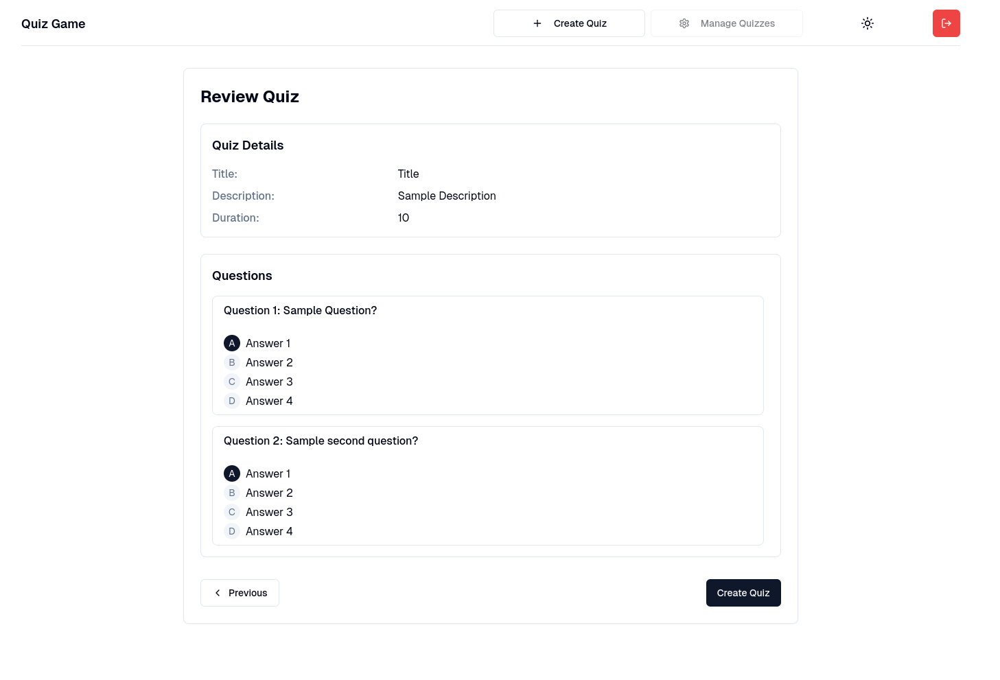

## 🔗 Live Demo

[Visit the Quiz Game](https://quiz-frontend-theta-peach.vercel.app/)

# Quiz Game

A modern, interactive quiz application that allows users to test their knowledge across various subjects through questions. The platform features a clean, responsive interface for users and comprehensive management tools for administrators.

### 📸 Screenshots

#### Home Page

## ✨ Features

### User Features
- **Browse Quizzes**: Explore a variety of quiz categories
- **Take Quizzes**: Answer multiple-choice questions with a user-friendly interface
- **Track Progress**: View detailed results including score, time taken, and accuracy
- **Responsive Design**: Enjoy a seamless experience on any device
- **Dark/Light Mode**: Choose your preferred theme for comfortable viewing

### Admin Features
- **Quiz Management**: Create, edit, and delete quizzes
- **Secure Authentication**: Protected admin dashboard
-
## 🛠️ Technologies Used

### Frontend
- **Vue.js**: Progressive JavaScript framework for building user interfaces
- **Tailwind CSS**: Utility-first CSS framework for rapid UI development
- **Shadcn UI**: High-quality UI components built with Tailwind CSS
- **Lucide Icons**: Beautiful, consistent icon set

### Backend
- **Laravel**: PHP framework for web application development
- **MySQL**: Relational database management system
- **Laravel Sanctum**: Authentication system for SPAs and simple APIs

### DevOps
- **Docker**: Containerization for consistent development and deployment
- **GitHub Actions**: CI/CD pipeline for automated testing and deployment
- **Vercel/Laravel Cloud**: Frontend hosting and deployment

## 📋 Prerequisites

- PHP 8.1 or higher
- Node.js 16.x or higher
- MySQL 8.0 or higher
- Composer
- npm or yarn
- docker

## 🚀 Installation

# Backend
- git clone https://github.com/Mckaay/QuizBackend.git
- cd QuizBackend
- cp .env.example .env
- add APP_SERVICE=php variable to .env
- composer install
- ./vendor/bin/sail up -d
- ./vendor/bin/sail php artisan migrate:fresh --seed
- ./vendor/bin/sail php artisan key:generate

# Frontend
- git clone https://github.com/Mckaay/QuizFrontend.git
- cd QuizFrontend
- create .env file and put there VITE_API_URL=http://localhost:80
- npm install
- npm run dev

## Default Admin Credentials (For demo purposes)
Email: admin@admin.com
Password: password